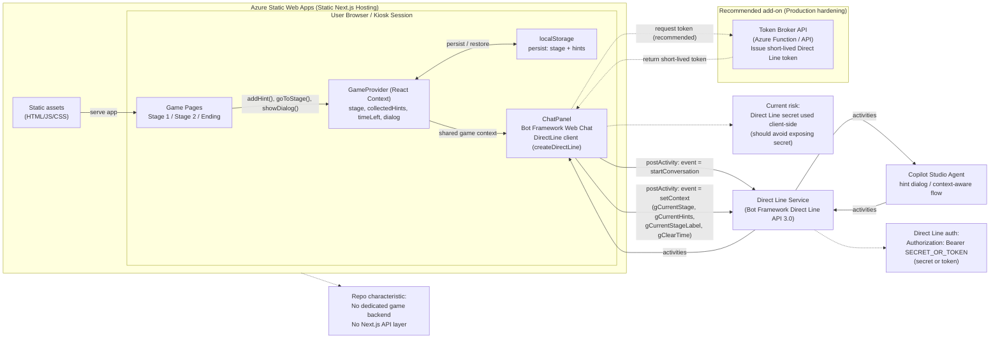

# 천재 탐정 K: 방탈출 데모 게임 🕵️‍♂️

"천재 탐정 K의 비밀 수첩"을 테마로 한 단서 수집형 웹 방탈출 게임입니다. 이 프로젝트는 **Microsoft AITour Copilot Studio Booth** 등의 행사 시연 데모를 위해 Next.js와 Tailwind CSS를 활용해 제작되었습니다.

## 📸 스크린샷


## 🧩 게임 특징
- **비주얼 노벨 UI**: 직관적인 하단 텍스트 및 대화창 지원
- **스테이지 기반 진행**: 총 2개의 스테이지와 탈출 엔딩으로 구성
- **실시간 타이머**: 5분 타이머가 긴장감을 더해주는 플레이 경험
- **저장 가능한 진행 상황**: LocalStorage 연동으로 실수로 화면을 종료해도 이어서 플레이 가능

## 🚀 빠른 시작 (Getting Started)

의존성 패키지를 설치하고 개발 서버를 가동합니다.

```bash
npm install
npm run dev
```

이후 브라우저에서 [http://localhost:3000](http://localhost:3000) 주소로 접속하면 게임을 플레이할 수 있습니다.

## 🛠 기술 스택
- **Framework**: Next.js (App Router)
- **Styling**: Tailwind CSS
- **Icons**: Lucide React
- **State Management**: React Context & LocalStorage

## Architecture


## 💡 플레이 팁
> 제한 시간 안에 맵 내의 여러 단서(힌트)를 찾아 모으고, 최종 비밀번호나 키워드를 유추해 닫혀 있는 문과 시스템의 잠금을 해제하세요!
